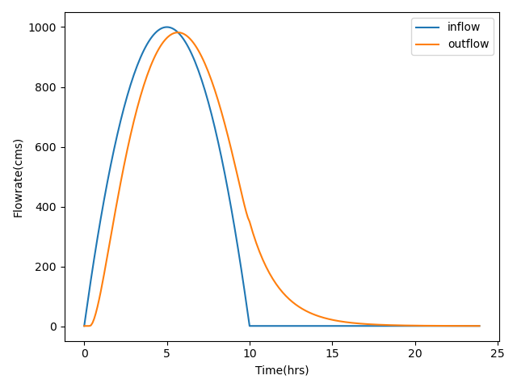

# Muskingum-Cunge Routing in Python

## Overview
`muskingumcunge` is a Python implementation of the Musking-Cunge model, a channel routing method that allows for the 
estimation of a hydrograph's lag and attenuation as it propogates downstream through a river network.  In this formulation, 
the Muskingum-Cunge method uses cross-sectional geometry and a Manning's flow assumption to derive parameters of the 
Muskingum method (K and X) at each timestep.

The example below shows how to use `muskingumcunge` to route a simple hydrograph through a trapezoidal channel.

```python
import numpy as np
import matplotlib.pyplot as plt
from muskingumcunge.reach import TrapezoidalReach
from muskingumcunge.timeseriestools import parabolic_hydrograph_generator

# Generate hydrograph
start = 0  # hours
stop = 24  # hours
dt = 0.1  # hours
timestamps = np.arange(start, stop, dt)
peak = 1000
duration = 10
inflows = parabolic_hydrograph_generator(timestamps, peak, duration)

# Build reach
reach = TrapezoidalReach(100, 100, 0.1, 0.001, 2000)

# Route flows
outflows = reach.route_hydrograph(inflows, 0.1)

# Plot results
fig, ax = plt.subplots()
ax.plot(timestamps, inflows, label='inflow')
ax.plot(timestamps, outflows, label='outflow')
ax.set_xlabel('Time(hrs)')
ax.set_ylabel('Flowrate(cms)')
plt.legend()
plt.tight_layout()
plt.show()
```



Current functonality of this package includes
- Calculation of channel geometry (top width, area, wetted perimeter, and hydraulic radius) as a function of stage
- Derivation of stage-discharge rating curve and Muskingum Parameters
- Simple synthetic unit hydrograph generation
- Muskingum-Cunge routing

Hopefully more reatures to come!!

## Installation

`muskingumcunge` can be installed using pip:
	
    $ python3 -m pip install muskingumcunge

or conda:

    $ conda install -c conda-forge muskingumcunge

## Issue tracker

Any bugs, suggestions, or questions may be logged using the issues tab

https://github.com/sclaw/muskingum-cunge/issues
